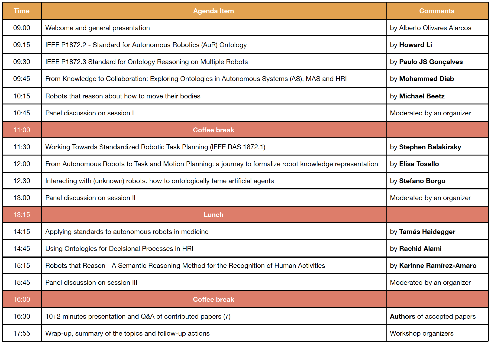

**Location:** ICC Capital Suite 16, ExCeL London

**Confirmed invited speakers (alphabetical order)**

- Rachid Alami, Laboratory for Analysis and Architecture of Systems (LAAS-CNRS), France
- Stephen Balakirsky, Georgia Tech Research Institute (GTRI), USA
- Michael Beetz, Institute for Artificial Intelligence, University of Bremen, Germany
- Stefano Borgo, Laboratory for Applied Ontology (LOA), ISTC CNR, Italy
- Mohammed Diab, Personal Robotics Laboratory, Imperial College London, United Kingdom
- Paulo J.S. Gonçalves, IDMEC - Center of Intelligent Systems, University of Lisbon/ Instituto Politécnico de Castelo Branco, Portugal
- Tamás Haidegger, Obuda University, Hungary
- Howard Li, University of New Brunswick, New Brunswick, Canada
- Karinne Ramírez-Amaro, Chalmers University of Technology, Sweden
- Elisa Tosello, Embedded Systems Unit, Fondazione Bruno Kessler, Italy

**Tentative agenda**

